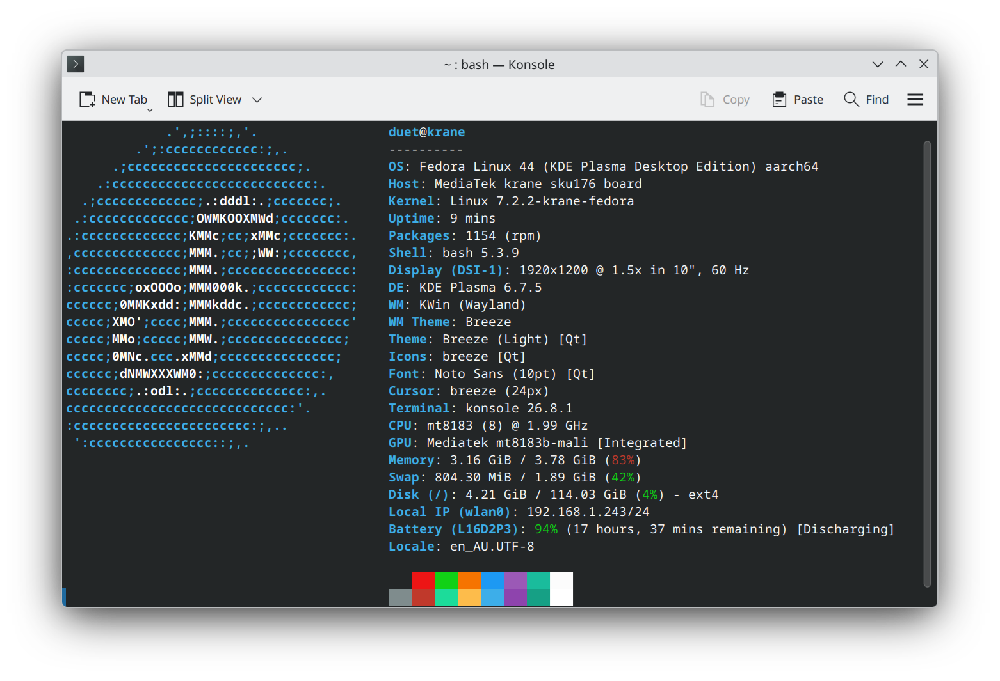

# FedoraOnDuet

Fedora KDE Plasma for the original Lenovo Chromebook Duet: MediaTek MT8183,
`kukui-krane`, with both SKU 0 and SKU 176 panel variants.
This is an independent device image, not an official Fedora or postmarketOS release.



Fedora 44, KDE Plasma on Wayland and Linux 7.2.2-krane-fedora running on a
Krane SKU176, with a Wi-Fi address assigned. Screenshot supplied from the device.

## Download and install

Download the current image and SHA-256 files from
[Releases](https://github.com/nosidak/FedoraOnDuet/releases/latest).
The compressed image expands to 12 GiB; use a USB drive of at least 16 GB.

```bash
sha256sum -c krane-fedora-kde-v0.2.1.img.zst.sha256
zstd -d krane-fedora-kde-v0.2.1.img.zst
sha256sum -c krane-fedora-kde-v0.2.1.img.sha256
```

Flash the extracted `.img` with Rufus (raw/DD mode if prompted) or Etcher.
Writing the image erases the selected USB drive. Enable Chromebook Developer
Mode and external boot, then boot the USB with Ctrl+U.

First login: press Ctrl+Alt+F3 and sign in as **duet** with **changeme**.
Complete the required password change, reboot, then use the new password in KDE.
Root is locked; SSH and automatic login are disabled.

Follow the [USB and eMMC installation guide](docs/install-fedora-emmc.md).
Installing to internal eMMC replaces ChromeOS and erases its local data.

## Included

- Fedora 44 ARM64, KDE Plasma Wayland, SDDM, Dolphin, Konsole and Firefox.
- Linux 7.2.2-krane-fedora, based on the postmarketOS MediaTek MT81 configuration.
- Qualcomm firmware support, including Fedora's XZ-compressed firmware.
- NetworkManager, PipeWire, Mesa, ZRAM, firewalld and SELinux.
- Chrony network time synchronization and the first-login dictionary fix.

Connect to Wi-Fi and let the clock synchronize before running DNF updates.
Normal Fedora package updates do not replace the custom signed Chromebook kernel.

KDE boot, login and Wi-Fi after manual firmware extraction were tested on an
earlier image. The current firmware-loader fix, automatic clock synchronization,
Bluetooth and final eMMC boot still need on-device confirmation.
See the [build report](docs/fedora-build-report.md) for validation details.

## Build

Use Ubuntu WSL2 or a suitable Ubuntu host. Keep kernel sources, rootfs and
temporary images on a native Linux filesystem. The default working directory
is `~/fedora/linuxonduet`.

```bash
bash scripts/setup-host.sh
bash scripts/build.sh
```

The output is `~/fedora/linuxonduet/out/krane-fedora-kde.img`. Supply another
`.img` filename to build again; existing outputs are never overwritten.
The builder writes image files, not physical storage devices. Package setup
uses QEMU ARM emulation, and the kernel is cross-compiled with LLVM.
Downloads and compiled sources are cached. Changed kernel inputs invalidate
the cache and preserve the previous source tree. Live Fedora repositories mean
future builds can contain different package versions.

```bash
python3 -m unittest discover -s tests -v
shellcheck scripts/*.sh
```

## Credits

This project depends on **postmarketOS** for the MediaTek MT81 kernel
configuration and hardware patches, and **Cadmium** for Chromebook boot tooling
and firmware references. Thanks to their maintainers and contributors, and to
Fedora, the Linux kernel developers, KDE, Mesa and the firmware maintainers.

See [NOTICE.md](NOTICE.md) for pinned sources, original authors, modifications
and licenses. Upstream copyright and attribution notices are retained.
